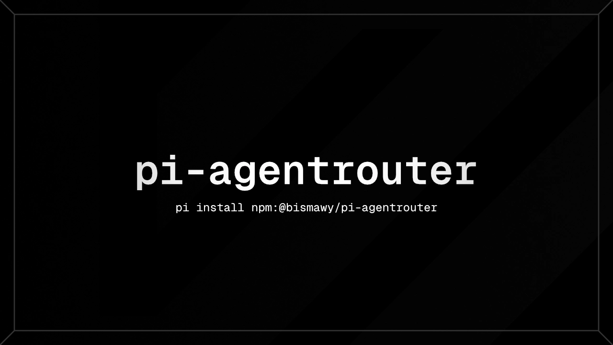

# ⚡ @bismawy/pi-agentrouter

**Unified [AgentRouter](https://agentrouter.org) provider for [pi coding agent](https://github.com/earendil-works/pi-coding-agent).**

Routes GPT-5.6 Sol, Claude Opus 4.8 / 5, DeepSeek V4 Flash, and GLM 5.3 under a single `agentrouter/` provider namespace with built-in WAF auto-recovery, dual OpenAI/Anthropic protocol handling, and payload sanitization.

[](https://github.com/earendil-works/pi-coding-agent)
[](https://www.npmjs.com/package/@bismawy/pi-agentrouter)
[](./LICENSE)



---

## ⚡ Quick Start

### 1. Installation
```bash
pi install npm:@bismawy/pi-agentrouter
```
*(Or install directly from Git: `pi install git:github.com/bismawy/pi-agentrouter`)*

### 2. Supply API Key
Provide your AgentRouter API key through any of the following methods:
- In Pi interactive session: `/login agentrouter`
- Environment variable: `export AGENTROUTER_API_KEY="your-api-key"`
- In `~/.pi/agent/models.json` under `providers.agentrouter.apiKey`

> 🎁 **Need an account?** Register via [AgentRouter Sign Up (Referral)](https://agentrouter.org/register?aff=CKdn) to get a **$50.00 bonus reward** (transferable to your account balance).

### 3. Switch Model
Run `/model` and pick any `agentrouter/<model-id>` (e.g. `agentrouter/gpt-5.6-sol`).

---

## 🤖 Registered Models (`agentrouter/`)

| Model | Context | Input | API Protocol | Thinking / Reasoning |
|---|---|---|---|---|
| `agentrouter/gpt-5.6-sol` | 272k | text, image | OpenAI Completions (`/v1`) | `low`, `medium`, `high`, `xhigh` |
| `agentrouter/claude-opus-5` | 200k | text, image | Anthropic Messages | `low`, `medium`, `high`, `xhigh` |
| `agentrouter/claude-opus-4-8` | 200k | text, image | Anthropic Messages | `low`, `medium`, `high`, `xhigh` |
| `agentrouter/deepseek-v4-flash` | 131k | text | OpenAI Completions (`/v1`) | `low`, `medium`, `high`, `xhigh` |
| `agentrouter/glm-5.3` | 131k | text | OpenAI Completions (`/v1`) | `low`, `medium`, `high`, `xhigh` |

---

## 🚀 Key Capabilities

- 🎯 **Unified Namespace with Dual Protocol Routing:** Automatically routes Claude models via per-model Anthropic Messages protocol while OpenAI, DeepSeek, and GLM models use OpenAI Completions under `agentrouter/`.
- 🛡️ **WAF Header & Language Guard:** Guarantees Pi's canonical system header sits at byte 0 (preventing `400 content-blocked` when custom instructions/`AGENTS.md` precede it) and applies language framing on user turns.
- 🔄 **Self-Healing WAF Redaction (1.2.x):** If AgentRouter's content filter triggers on non-English token ratios across long chat histories, turns are marked retryable while history text is progressively redacted (1 → 2 → 4 messages), preserving the latest request without user disruption.
- 🧹 **Robust Payload Sanitization:** Filters out ANSI escape codes, null bytes, non-printable control characters, and orphan Unicode surrogates before dispatching requests.
- ⚡ **Prompt Cache Affinity:** Injects `sendSessionAffinityHeaders: true` by default to maximize server-side prompt cache hits.

---

## 📖 Deep Dive & Technical Architecture

<details>
<summary><b>🛡️ WAF Auto-Recovery & History Redaction Details</b></summary>

### The Problem
AgentRouter WAF inspects request payload framing and token distributions. Long multilingual sessions (e.g., Bahasa Indonesia / non-English conversations with large code pastes) can trigger false-positive `400 content-blocked` errors.

### The Self-Healing Lifecycle
1. **Byte-0 Canonical Header:** The extension forces Pi's system prompt header to the very start of the payload.
2. **Dynamic Escalation:** Upon encountering `/sensitive[_ ]words?[_ ]detected|content-blocked/i`, the extension marks the error as retryable for Pi to restart the turn automatically.
3. **Progressive Redaction:** It replaces older user turn text blocks with `[Message redacted automatically to bypass content filter]` while keeping tool execution pairs intact.
4. **Anchor Reset:** New conversations or compaction cycles reset the redaction depth automatically.

</details>

<details>
<summary><b>⚙️ Accurate Model Capability Boundaries</b></summary>

- Models like `deepseek-v4-flash` and `glm-5.3` are explicitly declared as `input: ["text"]`.
- This prevents downstream `type 参数非法` 400 errors from AgentRouter when a previous conversation turn contains image payloads from other models.

</details>

---

## 📜 License & Acknowledgments

- Designed for the **[pi coding agent](https://github.com/earendil-works/pi-coding-agent)**.
- Header injection pattern aligned with `@madgagarin/pi-agentrouter`.
- Distributed under the **[MIT License](./LICENSE)**.
